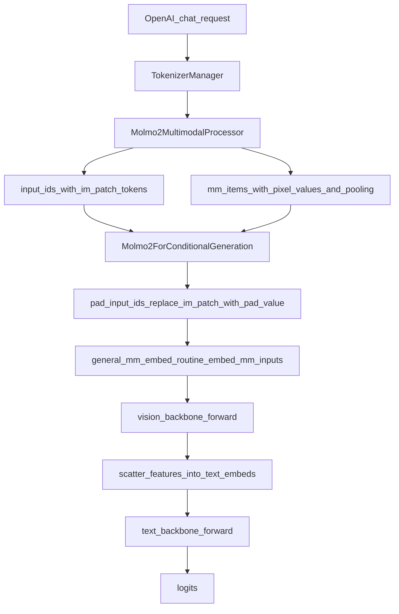

# Add Molmo2 (Molmo2-O-7B) Vision Support

## Goal

Implement SGLang-native runtime support for Hugging Face `allenai/Molmo2-O-7B` (HF `architectures`: `Molmo2ForConditionalGeneration`) by:

- Adding a new model implementation that can **load Molmo2 weights** and run **image/video multimodal inference**.
- Adding a dedicated **multimodal processor** that reproduces HF Molmo2’s prompt expansion + patch pooling alignment.

## Key findings from HF snapshot

- **HF architecture name**: `Molmo2ForConditionalGeneration` (from `config.json`).
- **Vision pipeline**: HF processor expands `<|image|>` / `<|video|>` into strings containing token IDs like:
  - `image_patch_id=100280` (`<im_patch>`)
  - `image_col_id=100281` (`<im_col>`)
  - `image_start_token_id=100278`, `image_end_token_id=100279`
  - `low_res_image_start_token_id=100282`
- **Vision inputs produced by HF processor**:
  - images: `pixel_values`, `image_token_pooling`, `image_grids`, `image_num_crops`
  - video: `pixel_values_videos`, `video_token_pooling`, `video_grids` (+ optional metadata)
- **Checkpoint module naming** (from `model.safetensors.index.json`):
  - text: `model.transformer.blocks.*.self_attn.att_proj`, `attn_out`, `mlp.ff_proj`, `mlp.ff_out`, `attn_norm`, `ff_norm`, `q_norm`, `k_norm`, `model.transformer.wte.(embedding|new_embedding)`, `lm_head.weight`
  - vision: `model.vision_backbone.image_vit.*`, `image_pooling_2d.*`, `image_projector.w1/w2/w3`

## Implementation approach

### 1) Model implementation (`Molmo2ForConditionalGeneration`)

Create a new SGLang model file implementing Molmo2 text + vision behavior:

- **New file**: [`python/sglang/srt/models/molmo2.py`](python/sglang/srt/models/molmo2.py)
- **EntryClass**: `Molmo2ForConditionalGeneration` (must match HF `architectures`).

#### 1.1 Text backbone

- Implement a Molmo2 text stack by **adapting the existing OLMo-style attention** in [`python/sglang/srt/models/olmo2.py`](python/sglang/srt/models/olmo2.py) but matching Molmo2 weight semantics:
  - Map checkpoint `self_attn.att_proj` → internal `qkv_proj`.
  - Map checkpoint `self_attn.attn_out` → internal `o_proj`.
  - Map checkpoint `mlp.ff_proj`/`mlp.ff_out` → internal MLP.
  - Use **QK norm** (`q_norm`, `k_norm`) like the checkpoint.
  - Implement Molmo2 MLP gating as **`x * silu(gate)`** (note: HF Molmo2 uses the opposite chunk ordering vs `SiluAndMul`).
- Implement the **split embedding** (`wte.embedding` + `wte.new_embedding`) by concatenating into a single `VocabParallelEmbedding` at load time.
- Keep the LM head output size = `config.text_config.vocab_size` (100278), matching checkpoint `lm_head.weight`.

#### 1.2 Vision backbone

Implement Molmo2’s vision backbone in SGLang:

- **Vision ViT**:
  - Patch embedding is a linear projection of flattened RGB patches.
  - No class token (HF sets `num_prefix_tokens=0`).
  - Positional embedding is interpolated for dynamic patch grid.
- **Pooling + projector**:
  - Use `image_token_pooling` (per-token indices of patches to pool) to build pooled patch tokens.
  - Apply a small attention pooling layer, then an MLP projector (`w1/w2/w3`) to text hidden size.
- Ensure `get_image_feature` / `get_video_feature` return embeddings in the **exact order of patch tokens** in the prompt.

#### 1.3 Multimodal token expansion / padding behavior

Implement `pad_input_ids` such that:

- Only `<im_patch>` tokens (id `config.image_patch_id`) are replaced with each item’s per-request `pad_value` for RadixAttention prefixing.
- `<im_start>`, `<im_end>`, `<im_col>`, `<low_res_im_start>` remain unchanged (they are regular tokens and do not receive vision features).

### 2) Multimodal processor for Molmo2

Add a new processor in SGLang that uses HF Molmo2’s own processors (image + video) and then constructs SGLang `mm_items` with correct offsets.

- **New file**: [`python/sglang/srt/multimodal/processors/molmo2.py`](python/sglang/srt/multimodal/processors/molmo2.py)
- Register it via the existing processor auto-import mechanism (`import_processors`).

Processor responsibilities:

- Use HF `Molmo2Processor` (trust_remote_code) to produce:
  - `input_ids` (already expanded from `<|image|>`/`<|video|>`)
  - image/video patch tensors (`pixel_values*`) and pooling tensors (`*_token_pooling`, `*_grids`, `image_num_crops`)
- Build one `MultimodalDataItem` per **image** (and optionally per **video**) with:
  - **feature**: the per-item `pixel_values` slice
  - **model_specific_data**: pooling tensors needed by the model
  - **offsets**: patch-token spans corresponding to `<im_patch>` token positions for that item
    - Compute patch-token positions by scanning `input_ids` for `config.image_patch_id` and splitting them based on per-item expected counts derived from `image_grids` and `video_grids`.
- Return a dict compatible with `MultimodalInputs.from_dict`, including any needed token ids (even if `pad_input_ids` doesn’t use them).

### 3) Register Molmo2 as multimodal

- Update [`python/sglang/srt/configs/model_config.py`](python/sglang/srt/configs/model_config.py) to include `Molmo2ForConditionalGeneration` in `multimodal_model_archs`.

### 4) Documentation

- Update [`docs/supported_models/multimodal_language_models.md`](docs/supported_models/multimodal_language_models.md) to add Molmo2.

### 5) Testing plan

- Add a minimal vision server test:
  - Extend an existing `test_vision_openai_server_*.py` to run a single image prompt through `Molmo2-O-7B` and compare output format (not exact text).
- Add a lightweight unit test for the processor offset bookkeeping:
  - Validate that for a synthetic prompt with 1 image, the number of `<im_patch>` tokens equals the number of pooled rows produced by `image_token_pooling`.

## Notes / risks

- **Bidirectional attention inside image blocks**: HF Molmo2 can optionally use `token_type_ids` to relax causal masking among image tokens. SGLang’s generation request path currently doesn’t transport `token_type_ids`, so the first PR will focus on **feature injection correctness** and may not exactly match HF attention masking. If quality regressions are observed, we’ll add a follow-up to support a Gemma3-style mask path for Molmo2.

## Mermaid: data flow

